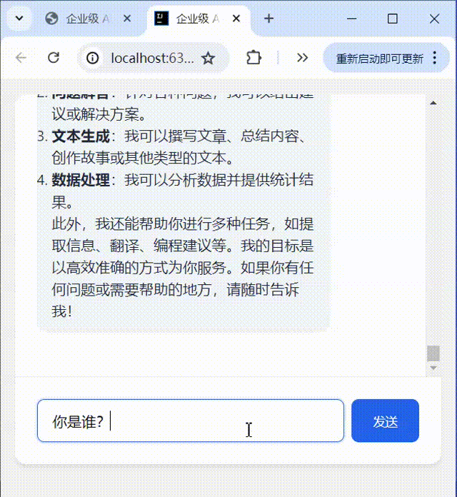
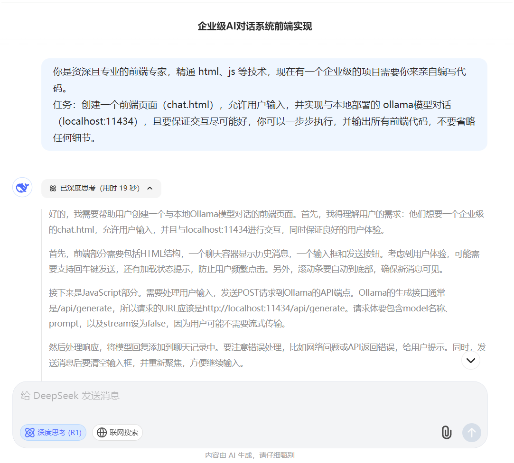
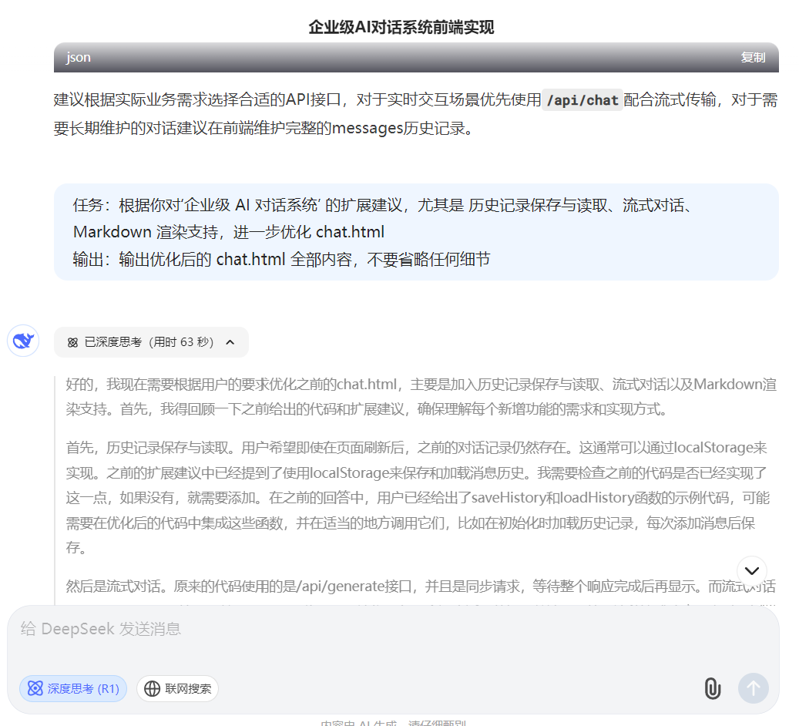

# Ollama Chat UI(By DeepSeek)

[](https://opensource.org/licenses/Apache-2.0)


**由 DeepSeek 写的** AI 对话系统前端实现，基于 Ollama 本地大模型部署，支持流式对话、Markdown 渲染和上下文管理。

> **你看到的这个 `Readme.md` 也是 DeepSeek 生成的**



## ✨ 核心功能

- **企业级交互设计**  
  响应式布局 + 优化视觉层次
- **流式对话支持**  
  实时显示生成过程，低延迟响应
- **智能上下文管理**  
  自动维护对话历史（可配置窗口大小）
- **专业 Markdown 渲染**  
  支持代码高亮/数学公式/表格等
- **多模型兼容**  
  默认支持 deepseek-r1、llama2、mistral 等 ollama 部署的模型

## 🚀 快速开始

### 前置要求
1. 安装 [Ollama](https://ollama.ai/)
2. 下载并运行 DeepSeek 模型：
```bash
ollama run deepseek-r1:8b
```

### 启动服务
```bash
git clone https://github.com/ChinaLym/ollama-chatui
cd ollama-enterprise-chat
python -m http.server 8000  # 或使用其他本地服务器
```

访问 [index.html](index.html) 即可使用

## ⚙️ 配置选项

在代码中可修改以下参数：
```javascript
// 上下文窗口设置
const MAX_CONTEXT_LENGTH = 4096;  // 最大上下文长度

// 模型参数
const MODEL_CONFIG = {
    model: 'deepseek-r1:8b',     // 默认模型
    temperature: 0.7,           // 生成随机性
    max_tokens: 1024            // 最大生成长度
};
```

## 📚 API 文档

### 支持的 Ollama 接口
| 端点                  | 方法   | 功能               |
|----------------------|--------|--------------------|
| `/api/chat`          | POST   | 流式对话接口       |
| `/api/generate`      | POST   | 单次生成接口       |
| `/api/tags`          | GET    | 获取可用模型列表   |

[查看完整 API 文档](https://github.com/ollama/ollama/blob/main/docs/api.md)

## 🔬 DeepSeek 创作过程

- 引导 DeepSeek 写一个 AI 对话页面



- 引导 DeepSeek 自己优化代码

  

- 引导 DeepSeek 创建 Github 相关工程与文件


## 🤝 贡献指南
欢迎通过 Issue 和 PR 参与贡献，请遵循以下步骤：
1. Fork 本仓库
2. 创建特性分支 (`git checkout -b feature/AmazingFeature`)
3. 提交更改 (`git commit -m 'Add some AmazingFeature'`)
4. 推送分支 (`git push origin feature/AmazingFeature`)
5. 发起 Pull Request

## 📄 许可协议
本项目采用 [Apache License 2.0](LICENSE) 开源协议
